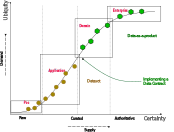

## Data system
### System of records. Place oriented. Mutable.
    + / - integration
    + deduplication
    + transactional
    + 

    - slow change
    - no inherent change tracking
    - different needs / cross dep conflicts
    - scalability
    - limited selfservice

### Data as product systems. Data Ids, versioned, immutable data.
    + Governance; policies, data properties
    + Selfservice / Discoverability
    + Focus on value

### Data Great devide
    Operational data, accuracy consistency availability for real-time use
     [signals orders trades]

    Data Products - data-driven system

    
| Feature | System of Records | Data Product |
|----------|----------|----------|
|    Data Types     |  Transactional, in place, unique operations        | Analytical series historical data          |
|    Purpose     |  Operational efficienty, transactional        | Data driven insights,  Quality(value) descisions          |
|    Structure     |  Structured, relational        | Polyglot, diverse formats          |
|Ownership|Centralized, place oriented| Decentralized adressable domain-driven
|Accessibility|Limited to operational users| Broad, self-service access

*'Interestingly, several organizations claim to have implemented the data mesh “by accident,” perceiving this paradigm as the natural evolution of data management.'*

### Data Mesh
    many arrive here by them self, lowering the barrier for company to publish, find, use data
    domain experts (who ever they might be; publish owning data products)

*'Many data products fail because they are a solution in search of a problem – for example, ingesting a new dataset into the data platform because ‘someone’ will find it useful. Adding more data does not necessarily solve a customer’s problems – or provide them with value. '*

*'It's important to note that data mesh adoption is an evolving process. While the technology is largely available, the greater challenge lies in the cultural and organizational shifts required to implement a successful data mesh. Many organizations are taking an incremental approach, starting with specific data products and gradually expanding their mesh over time'*

### Data Mesh Principles
    1. **Domain-Oriented Decentralized Data Ownership and Architecture**
    2. **Data as a Product**
    3. **Self-Serve Data Infrastructure as a Platform**
    4. **Federated Computational Governance**

### Data product req
    Discoverable
    Addressable (no place)
    Self describing 
    Owned and taken cared of (cross functional?)

### Thesaurus
    Lineage 
    Quality 
    Governance

### data certainty 
    * Raw data
    * Cureated data. Accuracy, relevant repersentation
    * Authoritative. Relevant, complete, consistent, documented.

    

### Components

    Data Governance system
    Data Catalogue
    Storage

    Execution Governance 
    Execution System

### Companies providing platforms/services for complete immersion
[atlan](https://atlan.com/?ref=/p/data-catalog-data-mesh/)
    - data catalog
    - metadata man

[K2View](https://www.k2view.com/)
    - data as product management with domain-oriented ownership
    - self service

[DataBricks](https://www.databricks.com/)
    -   Databricks
        Databricks is a unified data analytics platform built on Apache Spark.
    Key features:
        Lakehouse architecture combining data lake and data warehouse capabilities
        Strong support for data engineering, data science, and machine learning workflows
        Delta Lake for ACID transactions on data lakes
        Collaborative notebooks for data analysis and visualization
        Target users: Data engineers, data scientists, and analysts in organizations dealing with big data and advanced analytics
        Snowflake

[Danodo](https://www.denodo.com/)

[Snowflake](www.snowflake.com/)
    -   Snowflake is a cloud-based data warehousing platform.
    Key features:
        Separation of storage and compute for scalability
        Support for structured and semi-structured data
        Easy data sharing and collaboration
        Strong SQL support and optimization for analytics queries
        Target users: Business analysts, data analysts, and organizations focused on business intelligence and data warehousing

[Data Mesh Manager](https://www.datamesh-manager.com/)

### Data Catalogues (data, metadata, events)
[Linkedins Datahub](https://datahubproject.io/)

[Apache Atlas](https://atlas.apache.org/#/)

[Amundsen](https://www.amundsen.io/)

[Netflix Metacat](https://github.com/Netflix/metacat)
[info](https://netflixtechblog.com/metacat-making-big-data-discoverable-and-meaningful-at-netflix-56fb36a53520)

### Workflow orchestration systems, execution governance. 
[estuary](https://estuary.dev/)
        - Estuary is a real-time data operations platform.
    Key features:
        Real-time data integration and ETL
        Support for streaming and batch data processing
        Schema evolution and data quality management
        Open-source core (Flow) with cloud-hosted option
        Target users: Data engineers and organizations dealing with real-time data streams and complex data pipelines

[Airflow](https://airflow.apache.org/)

[Dagster](https://dagster.io/)

[Luigi](https://github.com/spotify/luigi)

[Kubelow](https://www.kubeflow.org/)

[Prefect](https://www.prefect.io/)

[Netflix, meastro](https://github.com/Netflix/maestro)

[Argo workflows](https://argoproj.github.io/workflows/)

[Differential Dataflow](https://github.com/timelydataflow/differential-dataflow/blob/master/differentialdataflow.pdf)

[Future](https://notebooklm.google.com/notebook/4f655dcf-38ad-4646-9b39-b5c7d16f24c4/audio?pli=1)