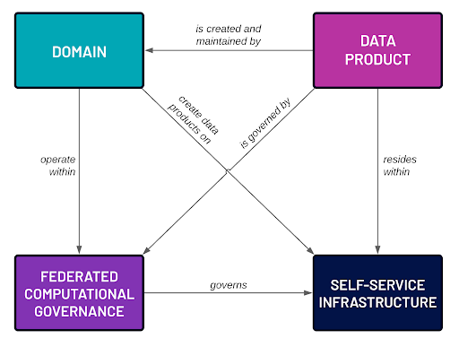

---
# league beige night serif solarized sky
theme: league  

title: "Data Mesh"

---

# Data Mesh

> *"Interestingly, several organizations claim to have implemented the data mesh 'by accident,' perceiving this paradigm as the natural evolution of data management."*  
> [1](https://blog.owulveryck.info/2024/04/09/data-as-a-product-and-data-contract-an-evolutionary-approach-to-data-maturity.html)

---

## Systems

**System of Record:** *Transactional operational systems*

**Data Lake:** *Traditional data pipeline systems*

**Data Mesh:** *Decentralized domain (cross-system) data products*

--

### Thesaurus Data

- **Place-Oriented:** Mutable state. Place associated with value. Updates records in place.
- **Value-Oriented:** Immutable values. Separated from place. Creates new versions or appends new data. Allows for decentralized use and value-based governance.

*Example: Version control systems; Git (value-oriented) vs. SVN (place-oriented).*

[Rich Hickey on Place-Oriented Programming](./sources/perplexity_placeoriented_vs_immutable.md)

---

### System of Record

Systems of Record (SOR) are traditional, centralized systems that serve as the authoritative source for specific data and functions within an organization.

--

**SOR Characteristics:**

- Place-oriented
- Mutable data—deduplicated
- Atomic operations—transactional
- Consistency—single source of truth
- Slow to change—system modeling creates bottlenecks
- No inherent change tracking
- Limited self-service and discoverability

---

### Data Lakes

Traditional pipelines with centralized data platforms. Data flows through a series of ingestion, cleansing, and transformation stages.

--

**Data Lake Characteristics:**
- Centralized repository storing raw data in generic format
- Decouples data from its place of origin
- Centralized team maintains and manages the data repository
- Excels at handling large volumes of data
- Struggles with diversity of data sources and shifting use cases

---

### SOR vs. Data Pipelines

--

**Representation:**

- **Systems of Record:** Data as mutable objects or records in fixed locations
- **Data Pipelines:** Data as immutable values flowing through transformations

--

**Historical Context:**

- **Systems of Record:** Often maintain only the current state
- **Data Pipelines:** Naturally preserve historical data and changes over time

--

**Processing Model:**

- **Systems of Record:** Rely on in-place updates and transactions
- **Data Pipelines:** Use functional transformations on immutable data streams

--

**Data Quality and Governance:**

- **Systems of Record:** May require complex mechanisms to ensure data integrity
- **Data Pipelines:** Leverage immutability and functional transformations for better data quality control

---

## Data Mesh

*"Many data products fail because they are a solution in search of a problem—for example, ingesting a new dataset into the data platform because 'someone' will find it useful. Adding more data does not necessarily solve a customer's problems or provide them with value."*

--

### Data Mesh Principles

1. **Domain-Oriented Decentralized Data Ownership and Architecture**
2. **Data as a Product**
3. **Self-Serve Data Infrastructure**
4. **Federated Computational Governance**

--



---

#### 1. Domain-Oriented Data

*Tackling complexity at the heart of data...*

- **Bounded Context:** Data is organized around specific business domains with clearly defined boundaries, managing complexity by breaking down large systems.
- **Unambiguous Language:** Emphasizes using a common language shared by technical and business teams within a domain.

--

- **Domain Experts:** Relies on domain experts to ensure data models accurately reflect business reality.
- **Decentralized Ownership:** Each business domain takes responsibility for its own data, enhancing stewardship and data quality.

--

- **Alignment with Business Structure:** Mirrors how businesses employ specialized teams for specific operations.
- **Improved Decision-Making:** Placing data ownership closer to the source enhances data-driven decisions.

---

#### 2. Data as a Product

*This principle treats data as a valuable asset, applying product thinking to data management.*

- **Product Thinking:** Data products have a vision, strategy, and roadmap. Ownership enhances stewardship, innovation, and experimentation.
- **Strategic Asset:** Data is a core product, not a byproduct of operations.

--

- **Quality Focus:** Data products are usable, understandable, correct, timely, and complete.
- **Lifecycle Management:** Managed through their entire lifecycle, from creation to retirement.
- **Cultural Shift:** Ownership is claimed, not assigned. Focus on delivering value, not just completing assignments.

---

#### 3. Self-Serve Data Infrastructure

*This principle aims to provide a platform that enables domain teams to easily create, maintain, and use data products.*

- **Unified Platform:** Provides domain-agnostic tools and systems, empowering users to autonomously develop and manage products.
- **Ease of Use:** Low barrier for adoption, allowing users to find, understand, and manage data products with built-in affordance.

--

- **Virtualization:** Data is virtualized rather than centralized—addressable and decentralized.
- **Flexibility:** The platform evolves based on domain requirements, balancing centralized infrastructure with domain-specific needs.

---

#### 4. Federated Computational Governance

*This principle ensures interoperability and consistency across the decentralized data ecosystem.*

--

- **Global Standards:** Establishes organization-wide standards for data, including required metadata and conventions.

  ```
  Namespace: prod | preprod | test
  Owner
  Lineage: data & execution
  Format: structured | unstructured
  Complexity: simple | complex
  Structure: lot | set | append
  Lifecycle Events
  Tombstoning | Initializations
  Authorization/Authentication
  ```
--

- **Automated Enforcement:** Governance rules are computationally enforced, reducing manual oversight.
- **Balance:** Strikes a balance between centralized control and domain autonomy.

---

#### Summary

*These principles work together to create a data ecosystem that is scalable, flexible, and aligned with business needs. The domain-oriented approach and data-as-a-product mindset address issues of data quality and relevance. The self-serve infrastructure enables efficient data product creation and consumption. Federated governance ensures that this decentralized system remains cohesive and compliant.*

---

#### Data Mesh vs. Data Lakes

- **Shifting Data Ownership:** From centralized teams to domain experts, leading to better data quality and governance.
- **Data Modeling:** From generic models accommodating all use cases to specific models reflecting each domain's unique needs and language.

--

- **Decoupling Data Pipelines:** From centralized control into smaller, domain-specific units, allowing for agile development and domain-specific innovation.
- **Emphasizing Data as a Product:** From a central team responsible for data quality to domain teams delivering high-quality, discoverable data products.
- **Providing Self-Service Infrastructure:** Empowers domain teams to manage their data products independently.

---

#### Organizational and Cultural Shifts

*A distributed approach promotes scalability, agility, and data quality by empowering domain teams and fostering a data-driven culture. Data Mesh recognizes that data is not a monolithic entity but a collection of interconnected, domain-specific datasets best managed by those closest to them.*

--

**Note:** This is not only an architectural shift. Everyone participates, benefits, and contributes.

---

#### Data Certitude

- **Raw Data**
- **Curated Data:** Accuracy, relevant representation.
- **Authoritative Data:** Relevant, traceable, complete, consistent, documented.


---

### Success Stories

**Organizations Implementing Data Mesh:**

- JP Morgan
- Saxo Bank
- Intuit
- PayPal

[Additional Examples](https://github.com/lynxoskar/data_mesh/blob/main/sources/perplexity_success_stories.md)

--

**PayPal Case Study:**

- *Scalability:* Started with 6 data products and rapidly expanded to about 40, demonstrating the scalability of the Data Mesh approach.
- *Regulatory Compliance and Security:* The decentralized nature allowed for improved compliance and security measures.
- *Autonomy for Data Domains:* Provided greater autonomy for different data domains to manage their own data pipelines.

[PayPal's Success Story](https://github.com/lynxoskar/data_mesh/blob/main/sources/perplexity_success_paypal.md)

---

### Cultural Mind Shift

*Data Mesh adoption is an evolving process. While the technology is largely available, the greater challenge lies in the cultural and organizational shifts required for successful implementation. Many organizations are taking an incremental approach, starting with specific data products and gradually expanding their mesh over time.*

--

*The transition from traditional systems to a Data Mesh is a significant undertaking that requires a holistic approach to organizational change. It involves technological shifts and fundamental changes in how people think about, manage, and use data. Success depends on strong leadership, clear communication, and a sustained commitment to building a data-driven culture across the entire organization.*

--

**Key Factors for Successful Transition:**

1. **Mindset Shift:**

   - Viewing data as a valuable product
   - Embracing decentralization and domain ownership

2. **Skill Development:**

   - Promoting data literacy across the organization
   - Developing data management and engineering skills within domain teams
   - Shifting platform teams' focus from control to enablement

--

3. **Leadership Support:**

   - Executive sponsorship for the transition
   - Clear communication of the vision and benefits

4. **Cross-Functional Collaboration:**

   - Breaking down silos between departments
   - Encouraging knowledge sharing and collaboration across domains

--

5. **Agile and Product-Oriented Thinking:**

   - Adopting agile methodologies for data product development
   - Focusing on user needs and continuous improvement

6. **Data Governance Evolution:**

   - Shifting from centralized control to federated governance
   - Developing new policies and standards for decentralized data management

--

7. **Continuous Learning Culture:**

   - Encouraging experimentation and learning from failures
   - Providing ongoing training and support for new tools and methodologies

8. **Change Management:**

   - Implementing a robust change management program
   - Addressing resistance to change and fostering buy-in

--

9. **New Roles and Responsibilities:**

   - Creating roles like data product owners and data domain leads
   - Redefining existing roles to align with the new data-centric approach

10. **Metrics and Incentives:**

    - Developing new KPIs aligned with data product thinking
    - Adjusting incentive structures to encourage data sharing and quality

---

### The Future is Here

*"Every member will be limited only by curiosity, vision, taste, and creativity."*

--

**Importance of Data Products in the Age of AI:**

- **Inefficient AI Implementations:** Without proper data products, AI tools may struggle to access relevant information, leading to suboptimal performance.
- **Increased Data Silos:** Absence of data products could exacerbate data silos, hindering comprehensive insights.

--

- **Missed Innovation Opportunities:** Companies may miss potential innovations uncovered by AI tools without accessible data products.
- **Reduced Agility:** Difficulty in accessing and analyzing data could slow responses to market changes.

--

- **Compliance and Governance Risks:** Ensuring data quality and compliance becomes more challenging.
- **Difficulty in Scaling AI Initiatives:** Lack of data products could limit scaling AI across departments.
- **Talent Retention Issues:** Frustration due to lack of high-quality data may lead to retention problems.
- **Missed Cross-Functional Opportunities:** Limits the ability to leverage cross-functional insights.

---

### Appendix: Components

**Key Components:**

- **Data Governance Systems**
- **Data Catalogs**
- **Storage Solutions**
- **Execution Governance**
- **Execution Systems**

--

#### Companies Providing Comprehensive Platforms

- **Starburst**

  - Built on open-source technologies
  - Provides analytics engine for Data Mesh

- **Atlan**

  - Data catalog and metadata management
  - Facilitates data discovery and collaboration

- **K2View**

  - Data-as-product management with domain-oriented ownership
  - Offers self-service capabilities

--

- **Databricks**

  - Unified data analytics platform built on Apache Spark
  - Lakehouse architecture combining data lake and data warehouse capabilities
  - Supports data engineering, data science, and machine learning workflows
  - Delta Lake for ACID transactions on data lakes
  - Collaborative notebooks for data analysis and visualization

--

- **Denodo**

  - Data virtualization and integration platform
  - Enables real-time data access without replication

- **Data Mesh Manager**

  - Specialized tools for managing Data Mesh architectures
  - Focuses on governance and domain management

--

- **Snowflake**

  - Cloud-based data warehousing platform
  - Separation of storage and compute for scalability
  - Supports structured and semi-structured data
  - Easy data sharing and collaboration
  - Strong SQL support optimized for analytics queries

---

#### Data Catalogs (Data, Metadata, Events)

- **LinkedIn's DataHub**

  - Open-source metadata platform
  - Facilitates data discovery and lineage tracking

- **Apache Atlas**

  - Open-source metadata management and governance
  - Integrates with Hadoop ecosystem

--

- **Amundsen**

  - Data discovery and metadata engine
  - Developed by Lyft for data cataloging

- **Netflix Metacat**

  - Unified metadata management system
  - Makes big data discoverable and meaningful

---

#### Workflow Orchestration Systems and Execution Governance

- **Estuary**

  - Real-time data operations platform
  - Supports real-time data integration and ETL
  - Handles streaming and batch data processing
  - Manages schema evolution and data quality

--

- **Apache Airflow**

  - Platform to programmatically author, schedule, and monitor workflows
  - Widely used for orchestrating complex data pipelines

- **Dagster**

  - Data orchestrator for machine learning, analytics, and ETL
  - Emphasizes software-defined data assets

--

- **Luigi**

  - Python module for building complex pipelines
  - Handles dependency resolution and workflow management

- **Kubeflow**

  - Machine learning toolkit for Kubernetes
  - Facilitates deployment of scalable ML workflows

--

- **Prefect**

  - Modern workflow orchestration tool
  - Focuses on dataflow and task scheduling

- **Netflix Maestro**

  - Workflow orchestrator for big data jobs
  - Manages job dependencies and scheduling

- **Argo Workflows**

  - Container-native workflow engine for Kubernetes
  - Executes DAGs of tasks using Kubernetes resources

---

# FIN